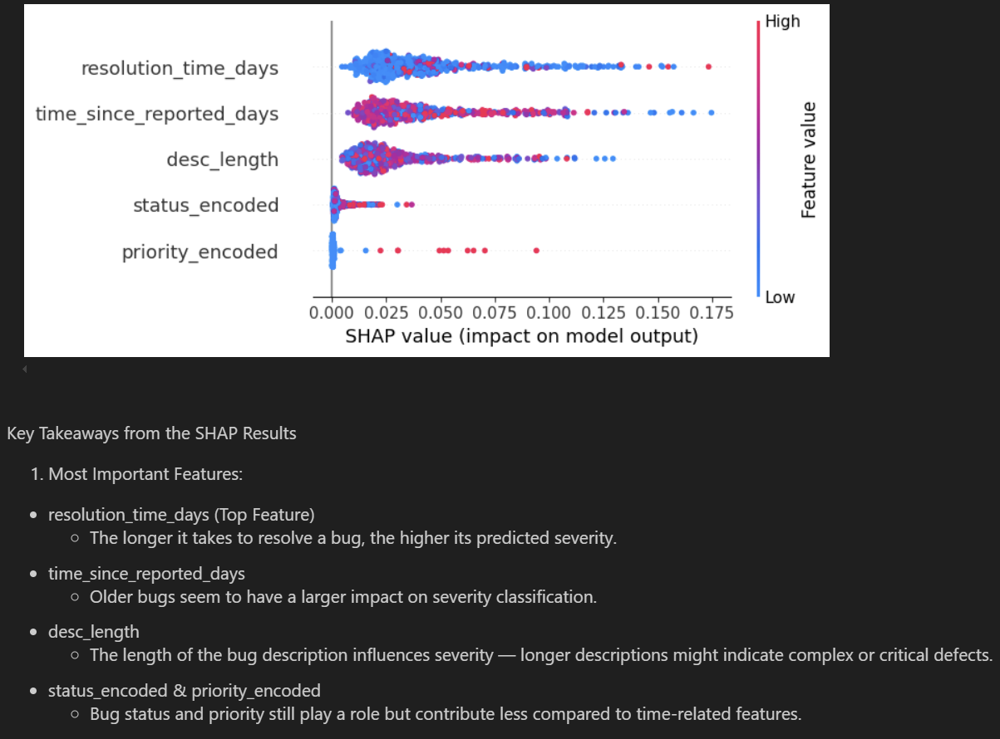
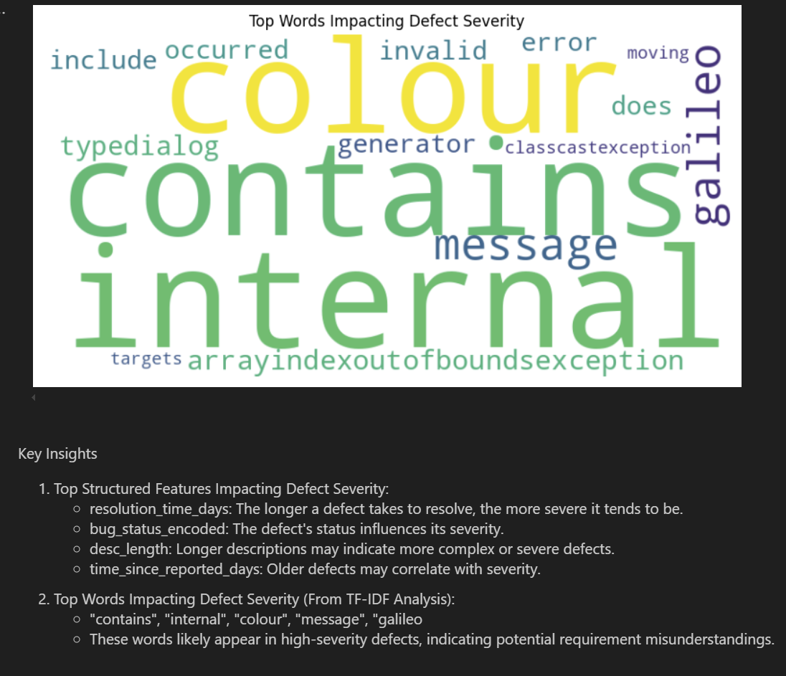

# Defect Severity Classification & Anomaly Detection in Software Defect Reports

## NON-TECHNICAL EXPLANATION OF THE PROJECT
Existing tools help identify defect rates, document requirements and user stories, and link test cases and results to these requirements. However, they lack the capability to identify trends that explain defect rates, particularly those caused by misinterpretation of requirements or user stories by developers or testers. The challenge is to identify trends in defect rates that can accurately determine if a defect results from such misinterpretations and understand why this occurs. 

## DATA
A summary of the data you’re using, remembering to include where you got it and any relevant citations. 
Eclipse and Mozilla Defect Tracking Dataset
This project utilises, specifically, the Eclipse data of the Eclipse and Mozilla Defect Tracking Dataset from MSR 2013 Bug Dataset, which contains over 200,000 reported bugs from two large open-source projects: Eclipse and Mozilla.
The dataset is publicly available through the Mining Software Repositories (MSR) 2013 dataset repository.
    - Hosted on GitHub: [GitHub - ansymo/msr2013-bug_dataset](https://github.com/ansymo/msr2013-bug_dataset).

## MODEL 
The model is designed for defect severity classification and anomaly detection in software defect reports.

- Inputs:
    - Structured Features: Priority, status, resolution time, time since reported, description length.
    - Text Features: Defect descriptions processed via TF-IDF or Word Embeddings.
- Outputs:
    - Defect Severity Classification (low, medium, high).
    - Anomaly Detection (identifies unusual defects using Isolation Forest).
- Model Architecture:
    - Feature Engineering: Categorical encoding, NLP-based text vectorization, and time-based features.
    - ML Models:
        - RandomForestClassifier for severity prediction.
        - Isolation Forest for anomaly detection.
    - Explainability: SHAP and feature importance analysis to interpret model decisions.
- Purpose: Helps automate defect triaging and detect misinterpretation-based defects.

## HYPERPARAMETER OPTIMSATION
Bayesian Optimisation is used to find the best values for:
- n_estimators
- min_samples_leaf
- max_features

## RESULTS
Severity is encoded in the first column of the classification report below: "blocker": 5, "critical": 4, "major": 3, "normal": 2, "minor": 1, "trivial": 0.
.png)



## (CONTACT DETAILS)
ahmed at aagbabs dot plus dot com. 

## Data Reference

1. Lamkanfi, A., Perez, J., & Demeyer, S. (2013).  
   *The Eclipse and Mozilla Defect Tracking Dataset: A Genuine Dataset for Mining Bug Information*.  
   In **10th Working Conference on Mining Software Repositories (MSR '13)**,  
   May 18–19, 2013, San Francisco, USA.  

   **BibTeX Citation:**
   ```bibtex
   @inproceedings{LamkanfiMSR13,
       author    = {Ahmed Lamkanfi and Javier Perez and Serge Demeyer},
       title     = {The Eclipse and Mozilla Defect Tracking Dataset: 
                    a Genuine Dataset for Mining Bug Information},
       booktitle = {MSR '13: Proceedings of the 10th Working Conference on Mining Software Repositories, 
                    May 18–19, 2013. San Francisco, California, USA},
       year      = {2013},
   }
