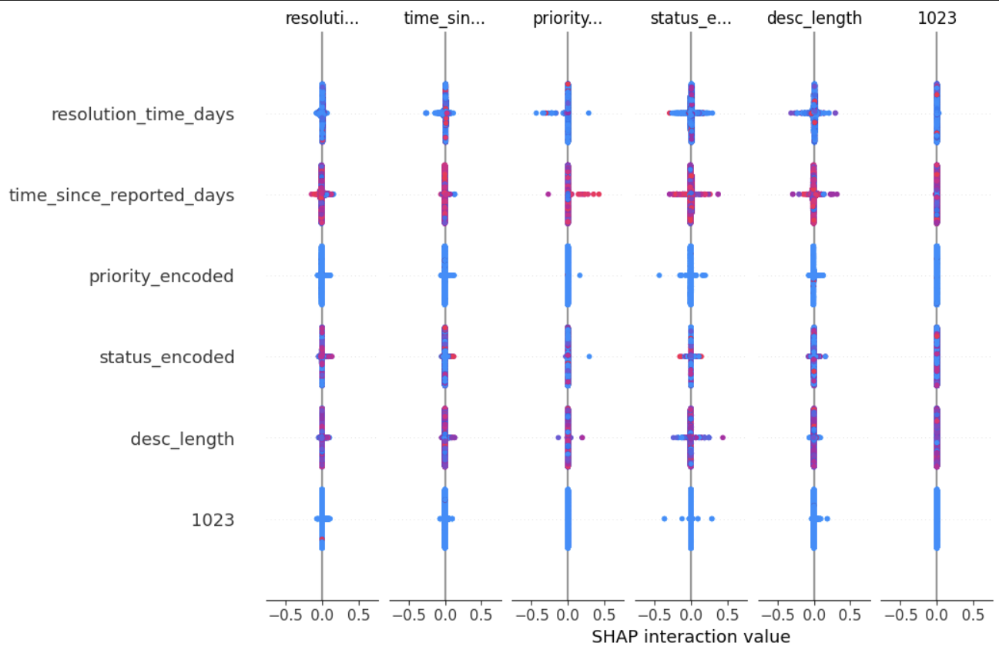

# Model Card

## Model Description

**Input:**
The model takes structured defect attributes and textual defect descriptions as input.
- Structured Features: priority_encoded, bug_status_encoded, resolution_time_days, time_since_reported_days, desc_length
- Textual Feature: short_description (processed using TF-IDF or word embeddings). 

**Output:**
- Defect Severity Classification: Predicts severity level (low, medium, high).
- Anomaly Detection: Identifies misinterpretation-based defect patterns using Isolation Forest.

**Model Architecture:**
The pipeline consists of the following components:
- Feature Engineering:
    - Label encoding for categorical features.
    - TF-IDF for text processing.
    - Time-based feature extraction.
- Machine Learning Models:
    - Defect Severity Prediction: RandomForestClassifier with hyperparameter tuning.
    - Anomaly Detection: Isolation Forest to detect unusual defect trends.
 - Explainability:
    - Feature importance analysis using SHAP or RandomForest Feature Importance.

**Dataset Description:**
Eclipse and Mozilla Defect Tracking Dataset
This project utilises, specifically, the Eclipse data of the Eclipse and Mozilla Defect Tracking Dataset from MSR 2013 Bug Dataset, which contains over 200,000 reported bugs from two large open-source projects: Eclipse and Mozilla.

**Why This Dataset?**
Comprehensive Coverage: Provides detailed defect histories with incremental modifications.
- Rich Metadata
    - Bug ID, Status, Severity, Priority, Resolution, Timestamps (opened, closed).
    - Developer/Tester Comments & Updates.
    - Categorisation of Bugs by Components & Modules.
    - Textual Descriptions of Defects for NLP-based analysis.
- Ideal for Requirement Misinterpretation Analysis:
    - Helps identify patterns in defects caused by misunderstandings in requirements or user stories.
    - Enables anomaly detection to flag unexpected defect trends.

**How the Dataset is Used in the Project**
1. Feature Engineering
    - Categorical Encoding: priority, bug_status, severity, resolution.
    - Time-based Features:
        - resolution_time_days: Time taken to resolve a defect.
        - time_since_reported_days: How long ago the defect was reported.
    - Text Processing:
        - TF-IDF or Embeddings on defect descriptions (short_description).
2. Predictive Modelling
    - Defect Severity Classification:
        - Model: RandomForestClassifier
        - Target Variable: severity_encoded.
    - Anomaly Detection:
        - Model: IsolationForest.
        - Purpose: Identify misinterpretation-based defects.

## Performance
Metrics Used:
- Classification Accuracy
    - F1-score
- ROC-AUC Score
- Precision-Recall Curve
- Feature Importance

Severity is encoded in the first column of the classification reports below: "blocker": 5, "critical": 4, "major": 3, "normal": 2, "minor": 1, "trivial": 0.

Performance on Test Data
.png)
.png)

Top Features Affecting Predictions
- resolution_time_days: Strong influence on predictions.
- time_since_reported_days: Important but interacts similarly to resolution_time_days.
- desc_length: Description length plays a role in defect severity classification.
- priority_encoded & status_encoded: Categorical features contributing to model decisions.

## Limitations

- Data Bias: The model is trained on a specific dataset (Eclipse/Mozilla defect reports), which may not generalise to all software projects.
- False Positives/Negatives: Misclassification of severity can impact prioritisation in development.
- Limited Context Understanding: TF-IDF does not fully capture semantic meaning; embeddings may be needed for better generalisation.

## Trade-offs

- Accuracy vs. Interpretability:
    - RandomForest is interpretable, but more advanced models (e.g., XGBoost, BERT) could improve accuracy.
- Detection Sensitivity:
    - Isolation Forest anomaly detection has contamination tuning trade-offs—lower values detect fewer but higher-quality anomalies, while higher values flag more anomalies but increase false positives.
- Feature Engineering Impact:
    - Different NLP techniques (TF-IDF vs. Embeddings) affect how well textual features contribute to classification.
